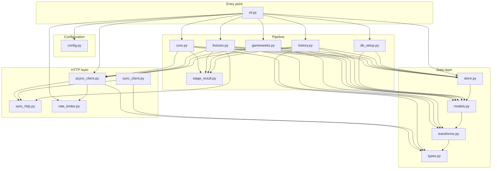

# Architecture

fpl-ingest fetches data from the FPL API (bootstrap-static, fixtures, live gameweek, element-summary endpoints) and writes it into a local SQLite database, with raw JSON responses cached to disk alongside it.

---

## Layer reference

### Entry point

**cli.py** — owns argument parsing, configuration wiring, pipeline orchestration, stage recording, and the process exit code; does not contain fetch logic, transformation, or SQL.

---

### Configuration

**config.py** — owns resolution of `FPL_DB_PATH` and `FPL_RAW_DIR` environment variables into an `IngestConfig` dataclass, with CLI overrides merged on top; does not validate that paths exist or are writable.

---

### HTTP layer

**sync_http.py** — owns retry logic, pacing (via `RequestGate`), response decoding, and shared constants (`DEFAULT_MAX_RETRIES`, `RETRYABLE_STATUS_CODES`, `compute_retry_delay`, `parse_retry_after`, `FPLClientError`) used by both clients; does not know about FPL domain objects.

**sync_client.py** — owns the `requests`-based synchronous FPL client with in-memory bootstrap caching; kept for backwards compatibility and use cases that do not require concurrency; does not run the pipeline itself.

**async_client.py** — owns the `aiohttp`-based async FPL client with per-dispatch rate limiting, exponential backoff, and in-memory bootstrap caching; borrows retry constants and error types from `sync_http.py`; does not know about domain models or pipeline stages.

**rate_limiter.py** — owns the `TokenBucketLimiter` (token bucket + asyncio semaphore) and `NoopRateLimiter` implementations behind the `RateLimiter` protocol; does not issue HTTP requests or touch domain objects.

---

### Pipeline

**core.py** — owns bootstrap-static ingestion: fetching, raw-cache write, and upsert of players, teams, events, and element types; returns a `CoreData` named tuple consumed by downstream stages; does not contain HTTP or SQL logic directly.

**fixtures.py** — owns fixture and fixture-stat ingestion: fetch, flatten, validate, and upsert; does not aggregate or derive stats beyond what the API provides.

**gameweeks.py** — owns concurrent live-endpoint ingestion for all finished and current gameweeks, including cache-skip logic and atomic JSON writes; does not touch player history or core bootstrap data.

**history.py** — owns per-player element-summary ingestion, partitioned between cached reads from disk and concurrent network fetches for uncached players; does not touch gameweek or bootstrap data.

**db_setup.py** — owns all DDL: table registration, unique constraints, index creation, and setup of `_runs` and `_metadata` audit tables; does not fetch data or write rows.

**stage_result.py** — owns the `StageResult` frozen dataclass returned by every pipeline stage; has no dependencies on any other fpl-ingest module.

---

### Data layer

**models.py** — owns all Pydantic domain models and the `pydantic_to_sqlite_column` / `schema_to_create_table` schema-generation helpers; does not perform I/O or pipeline orchestration.

**transforms.py** — owns all stateless payload transformations: `flatten_live_element`, `flatten_live_elements`, `flatten_fixture_stats`, `flatten_event`, `validate_models`, and the `ELEMENT_TYPE_TO_POS` / `POS_TO_ELEMENT_TYPE` mappings; does not perform I/O or import domain models.

**store.py** — owns the `SQLiteStore` class: connection management, table creation, column migration, bulk upsert via `ON CONFLICT DO UPDATE`, and the `_runs` / `_metadata` write methods; does not know about FPL API structure beyond what Pydantic schemas expose.

**types.py** — owns the `JSON` type alias used across the codebase; contains no logic.

---

## Data flow

A single full ingestion run from `fpl-ingest` invocation to final database write proceeds as follows.

1. `main()` calls `asyncio.run(_run_pipeline(argv))`. `_run_pipeline` calls `build_parser().parse_args(argv)` then `resolve_config(db_path=args.db, raw_dir=args.raw_dir)`, which merges CLI overrides on top of environment-variable defaults and returns an `IngestConfig`.

2. `SQLiteStore(config.db_path)` is constructed, creating the database file and parent directory if absent. A `TokenBucketLimiter(rate=args.rate, max_concurrent=10)` is created and injected into `AsyncFPLClient(rate_limiter=rate_limiter, connector_limit=10)`. The client is opened via `async with`, which calls `_ensure_session()` to create the `aiohttp.ClientSession` inside the running event loop.

3. Inside `with store.transaction()`, `setup_store(store)` in `db_setup.py` calls `store.register_table()` for every domain table (with grain constraints where applicable), `store.create_index()` for query-path indexes, and `store.setup_runs_table()` / `store.setup_metadata_table()` for audit tables. All DDL shares the same connection as the subsequent writes.

4. `ingest_core_data(client, store, config.raw_dir)` calls `client.get_bootstrap()`, which dispatches through `_fetch_with_retries()` under rate-limiter control. The raw response is written to `cache_dir/bootstrap.json`. For each entity type, `validate_models(Schema, raw_list)` validates the raw dicts through Pydantic and counts skipped rows, then `store.upsert_models("table", Schema, dicts)` bulk-upserts via `INSERT ... ON CONFLICT(id) DO UPDATE`. `ingest_core_data` returns a `CoreData` named tuple and a `StageResult`; the CLI passes the result to `_record_stage()`, which calls `store.record_run()` and emits a skip-rate warning if applicable.

5. `ingest_fixtures(client, store, raw_dir)` calls `client.get_fixtures()`, writes `fixtures.json`, then calls `store.upsert_models("fixtures", FixtureModel, ...)` for fixture rows and `flatten_fixture_stats(fixture)` followed by `store.upsert_models("fixture_stats", FixtureStatModel, ...)` for per-player stat rows. Each stage runs inside its own `store.transaction()` block in the CLI, isolating its writes.

6. `ingest_gameweeks(client, store, raw_dir, core.events, force=args.force)` calls `_select_gameweeks_to_fetch()` to filter by cache-file existence and the `force` flag. `asyncio.gather(*[_fetch_one_gameweek(...) for gw in ids])` dispatches all fetches concurrently under the rate limiter. Each `_fetch_one_gameweek` call writes an atomic `.tmp`-then-rename JSON file and calls `flatten_live_elements(data["elements"], gameweek_id)` to produce flat dicts for `GameweekModel`. `_upsert_gameweek_rows()` then calls `store.upsert_models("gameweeks", GameweekModel, rows)` in ascending gameweek order.

7. `ingest_player_histories(client, store, raw_dir, player_ids, force=args.force)` calls `_partition_by_cache()` to split IDs into cached and uncached sets. Cached players are loaded from `raw_dir/players/{id}.json` and upserted via `_upsert_history_rows()` → `store.upsert_models("player_histories", PlayerHistoryModel, ...)`. Uncached players are fetched concurrently via `asyncio.gather(*[client.get_player_history(pid) ...])`, written atomically to disk, then upserted. The progress log fires every 50 players.

8. After all four stages, `_log_run_summary(logger, stage_results)` emits a compact table of per-stage counts. `_exit_code()` sums `result.errors` across stages; if zero, `_write_success_metadata()` upserts `last_successful_run_at`, `current_gameweek`, and `total_players` into `_metadata` and returns 0. If any stage had errors, it logs the error count and returns 1, which `main()` passes to `sys.exit()`.

---

## How to add a new pipeline stage

The steps below follow the pattern in `fixtures.py`, `gameweeks.py`, and `history.py`.

1. Add the endpoint URL to `_ENDPOINTS` in `async_client.py` (e.g., `"transfers": f"{_FPL_BASE}/transfers/"`). Add an async method `get_<resource>(self) -> JSON` that calls `_fetch_with_retries()` and raises `FPLClientError` if the result is `None`, matching the pattern of `get_fixtures()`.

2. Add the same URL to `ENDPOINTS` in `sync_client.py` and add a corresponding sync method `get_<resource>(self) -> Optional[JSON]` that calls `self._get(url)`, matching the pattern of `get_fixtures()`.

3. Define a Pydantic model in `models.py`. Use `STRICT_MODEL_CONFIG` (or `ALIASED_STRICT_MODEL_CONFIG` if any field needs an alias). If the table has a composite unique key, declare `GRAIN_CONSTRAINT: ClassVar[str] = "UNIQUE(col1, col2)"`. Add a `.prepare()` classmethod if any raw API fields must be stripped or renamed before validation.

4. Register the table in `pipeline/db_setup.py` by adding a `store.register_table("<table>", <Resource>Model, unique_constraint=<Resource>Model.GRAIN_CONSTRAINT)` call inside `setup_store()`. Add any `store.create_index()` calls for columns that will appear in downstream `WHERE` clauses.

5. Create `pipeline/<resource>.py`. Define `async def ingest_<resource>(client: AsyncFPLClient, store: SQLiteStore, raw_dir: Path, ...) -> StageResult`. The function should: fetch via the client method, write raw JSON atomically (`.tmp` then rename), validate with `validate_models()` or `store.upsert_models()`, and return a `StageResult(stage="<resource>", fetched=..., upserted=..., skipped=..., errors=...)`.

   Note: `gameweeks.py` is the cleanest pattern to follow for the transform step — it imports `flatten_live_elements` from `transforms.py` directly and calls no `.prepare()` method. `history.py`, `fixtures.py`, and `core.py` all call `.prepare()` directly on the model class; these are candidates for a future refactor but should not be used as the template for new stages. Import `validate_models` and any flatten or convert functions from `transforms.py` explicitly. This keeps the transform layer consistent and testable in isolation.

6. Export the new function from `pipeline/__init__.py` by adding it to the import list and `__all__`.

7. In `cli.py`, add a `with store.transaction(): _record_stage(await ingest_<resource>(...))` block inside `_run_pipeline()`. Position it after any stages whose output it depends on (pass `core.players` or `core.events` as needed).

8. Before committing, verify: `store.register_table` is called inside `setup_store` (not lazily at runtime); the `StageResult.stage` string is unique across all stages; the raw JSON is written with the `.tmp`-then-rename pattern; and the new function appears in `pipeline/__init__.__all__`.

---

## Key design decisions

- `pydantic_to_sqlite_column` and `schema_to_create_table` live in `models.py` rather than `store.py` because `store.py` imports `models.py` for those helpers. Placing them in `store.py` would create a circular import since `models.py` directly imports `ELEMENT_TYPE_TO_POS` and `cost_to_millions` from `transforms.py`, and `store.py` would then need to import from a module that is itself still loading.

- `AsyncFPLClient` creates its `aiohttp.ClientSession` lazily in `_ensure_session()` rather than in `__init__` because `aiohttp.ClientSession` must be instantiated inside a running event loop. `__init__` is called before `asyncio.run()` starts the loop, so deferring session creation to first use avoids the `RuntimeError: no running event loop` that would otherwise occur.

- Finished gameweeks are cached to disk and skipped on re-runs by default. Finished gameweek data is stable once FPL has settled bonus points and score corrections (typically within 24-48 hours of a gameweek closing), so re-fetching it every run wastes API quota. The cache-skip logic in `_select_gameweeks_to_fetch()` checks for `gw_{n}.json` existence and only the current (non-finished) gameweek is always re-fetched.

- Both `sync_client.py` and `async_client.py` exist because the sync client predates the async pipeline rewrite. The sync client is preserved for callers that cannot use async (scripts, notebooks, or external consumers of the library that do not run an event loop). The async client is what the pipeline itself uses.

- Player history fetches run concurrently via `asyncio.gather()` rather than sequentially because the player list is 826 entries long. At 10 req/s sequential dispatch, 826 requests take a minimum of 82.6 seconds in network time alone. Concurrent dispatch under the `TokenBucketLimiter` keeps the same sustained rate while allowing all in-flight requests to overlap, matching the theoretical ceiling.

- `cli.py` imports five modules directly (`async_client`, `config`, `pipeline`, `rate_limiter`, `store`) because it owns stage orchestration — it wires config, store, HTTP client, rate limiter, and the pipeline package (which re-exports all four stage functions plus `setup_store`) into a single run. A future `pipeline/runner.py` could absorb the stage wiring and reduce `cli.py` to argument parsing and exit code only.
